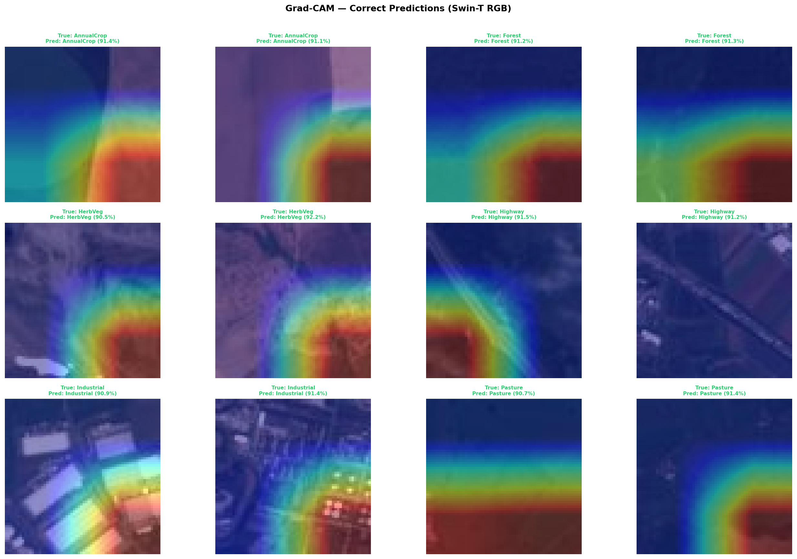
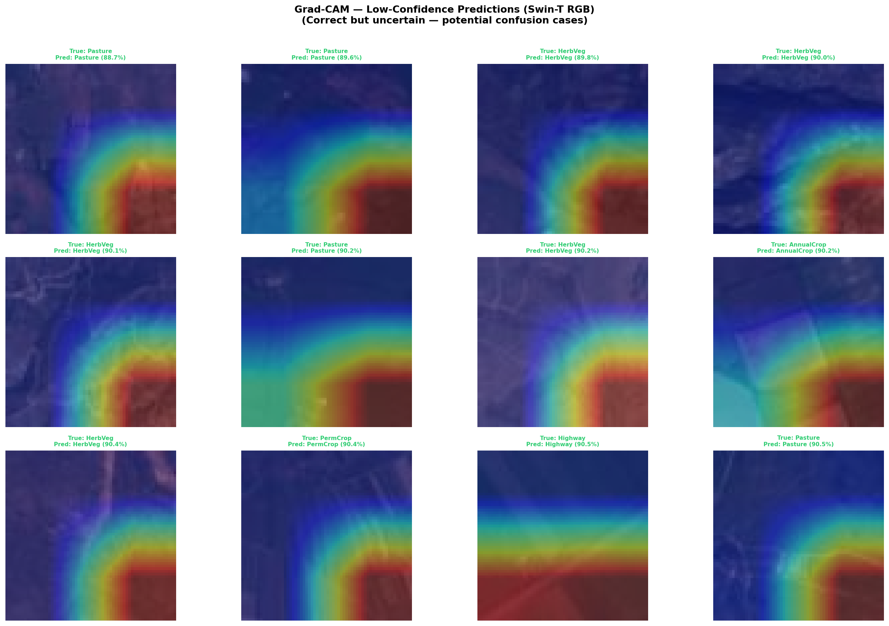
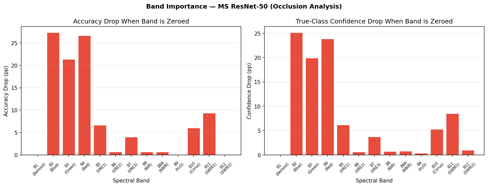
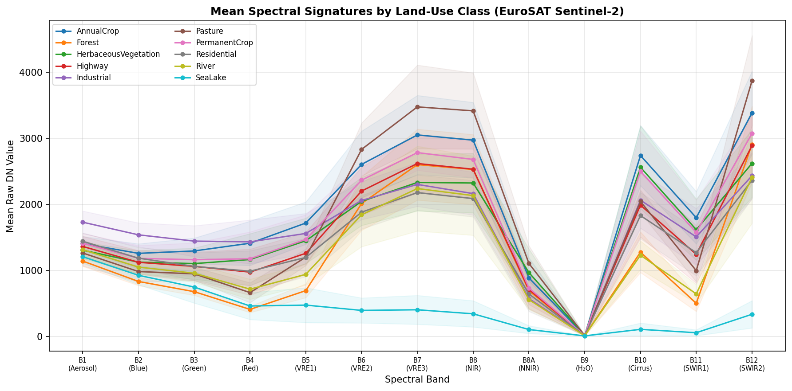
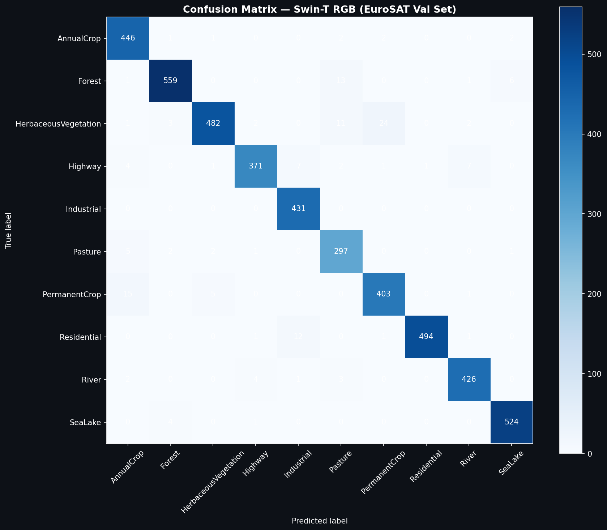
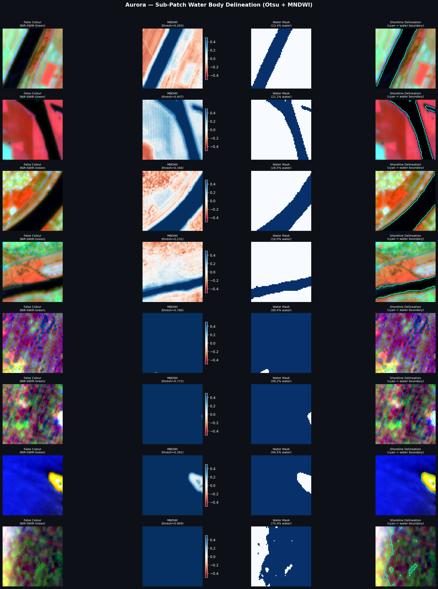

# Aurora — Geo Snap Paradigm
## Technical Report: Land-Use Classification & Explainability from Space

**Team:** Aurora  
**Competition:** GeoSnap — SOI × Cosmosoc  
**Submission:** Aurora_Geosnap_submission  
**Date:** June 2026

---

## 1. Introduction

Satellite-based land-use classification is a foundational problem in geospatial intelligence. Accurate, automated classification of Sentinel-2 imagery enables crop monitoring, urban planning, deforestation detection, and disaster response at continental scale. This report describes Aurora's approach to the GeoSnap challenge: classifying 64×64 Sentinel-2 patches into 10 land-use classes using both RGB and 13-band multispectral (MS) imagery, with interpretable model explanations.

The central hypothesis we test is whether the additional spectral information in 13-band Sentinel-2 imagery measurably improves classification over RGB alone — particularly for visually ambiguous class pairs that are spectrally distinct.

---

## 2. Dataset & Preprocessing

### 2.1 Dataset

The EuroSAT dataset provides 64×64 pixel Sentinel-2 patches in two modalities:

| Modality | Format | Images | Channels |
|----------|--------|--------|----------|
| RGB | JPEG | 27,000 | 3 (B4/B3/B2) |
| Multispectral | GeoTIFF | 27,597 | 13 (B1–B12) |

Ten land-use classes are represented: AnnualCrop, Forest, HerbaceousVegetation, Highway, Industrial, Pasture, PermanentCrop, Residential, River, SeaLake.

### 2.2 Critical Finding: Official Split Domain Shift

The competition-provided train/val directory split exhibited a severe domain shift that made standard evaluation unreliable. Spectral analysis of AnnualCrop files revealed NIR channel means of ~1,553 DN in `train/` but ~3,338 DN in `val/` — a 2× difference attributable to different crop growth stages at acquisition time (phenological shift, not sensor noise). Training on the official split produced 97% train accuracy but only 10% validation accuracy — worse than random chance (18% for 10 classes).

**Fix:** All 22,950 files from both `train/` and `val/` directories were pooled and randomly split 80/20 with `seed=42`, yielding 18,360 training and 4,590 validation samples with consistent spectral distributions.

### 2.3 Normalization

**Global normalization** was used exclusively. Per-file normalization was explicitly avoided because it forces each band independently to N(0,1), erasing inter-band ratios that encode physical spectral signatures. Spectral indices like NDVI = (B8−B4)/(B8+B4) become meaningless when B8 and B4 are independently normalized per image.

Normalization statistics were computed from all training files:

**RGB:**
```
Mean: [0.312, 0.344, 0.370]   Std: [0.188, 0.128, 0.110]
```

**Multispectral (13-band, raw DN):**
```
B1:1353±245  B2:1117±334  B3:1041±395  B4:946±594
B5:1199±567  B6:2002±860  B7:2373±1086 B8:2301±1117
B8A:733±404  B9:12±5      B10:1820±1002 B11:1118±760  B12:2599±1230
```

### 2.4 Augmentation

All augmentations preserve spectral integrity:
- Random horizontal flip, vertical flip, rotation 0–360° (satellite imagery is rotationally invariant — there is no canonical "up")
- **CutMix** (RGB): pastes patches from different images; operates spatially only, leaving spectral values unaltered
- **ColorJitter deliberately excluded**: brightness/contrast transforms alter physical band ratios, making the augmented images physically implausible for spectral models

---

## 3. Task 1 — Land-Use Classification

### 3.1 RGB Classification (Swin Transformer)

**Architecture:** Swin Transformer Tiny (Swin-T), pretrained on ImageNet-1K via `timm`. The classification head was replaced with `Linear(768, 10)`.

**Rationale for Swin-T over CNN:** Satellite patches exhibit global spatial structure (field boundaries, road networks, water body shapes) that benefit from the shifted-window self-attention mechanism's ability to capture long-range dependencies. Standard CNNs with local receptive fields require many layers to reach global context on 64×64 inputs.

**Training:**
- Optimizer: AdamW, lr=5×10⁻⁵, weight decay=1×10⁻⁴
- Schedule: CosineAnnealingLR, T_max=40, η_min=1×10⁻⁶
- Stochastic Weight Averaging (SWA) from epoch 30: averages weights across late-training checkpoints, finds flatter loss minima, improves generalization without additional data
- Label smoothing: ε=0.1
- 40 epochs, batch size 64

**Result: 96.58% validation accuracy**

### 3.2 Multispectral Classification (ResNet-50 with Weight Surgery)

**Architecture:** ResNet-50 with first-layer weight surgery to accept 13-channel input.

The standard `conv1` weight tensor (shape `[64, 3, 7, 7]`) was expanded to `[64, 13, 7, 7]`:
- Channels 1–3 (B2/Blue, B3/Green, B4/Red) initialized from pretrained ImageNet weights, mapping optical bands to their visual equivalents
- Channels 4–13 (B1, B5–B12) initialized with **Kaiming normal** initialization

The Kaiming initialization choice is critical: initializing non-optical channels with the mean of RGB weights — a common alternative — makes all 10 new channels identical at t=0. The gradient update is then identical for all channels throughout early training, preventing the network from learning band-specific features. Kaiming initialization breaks this symmetry.

**Training:**
- Optimizer: AdamW, lr=5×10⁻⁴, weight decay=1×10⁻⁴
- Schedule: CosineAnnealingLR, T_max=35, η_min=1×10⁻⁶
- Gradient clipping: max norm=1.0
- Label smoothing: ε=0.1
- 35 epochs, batch size 32

**Result: 99.37% validation accuracy**

### 3.3 Results Summary

| Model | Modality | Architecture | Val Accuracy |
|-------|----------|-------------|-------------|
| Swin-T | RGB (3 bands) | Transformer | 96.58% |
| ResNet-50 MS | 13-band Sentinel-2 | CNN + surgery | **99.37%** |

The +2.79 percentage point improvement from multispectral data, while modest in aggregate, is concentrated on class pairs that are visually identical in RGB but spectrally distinct — discussed in Section 4.3.

### 3.4 Implementation Notes (Apple M4 MPS)

All training ran on Apple Silicon (M4 chip, MPS backend). Three hardware-specific constraints applied:
- `num_workers=0`: Python 3.14 multiprocessing spawn conflicts on macOS
- `pin_memory=False`: MPS does not support pinned host memory
- No AMP: `torch.cuda.amp.autocast()` is CUDA-only; MPS has no equivalent in PyTorch at training time

---

## 4. Task 2 — Explainability & Model Interpretation

### 4.1 Visual Explainability — Grad-CAM (Swin-T RGB)

**Method:** Gradient-weighted Class Activation Mapping (Selvaraju et al., 2017). Gradients of the target class score with respect to the final attention block's LayerNorm activations are pooled spatially and used to weight the activation maps, producing a coarse heatmap of model attention.

**Target layer:** `layers[-1].blocks[-1].norm2` (final LayerNorm of Swin-T)

**Observation:** Attention maps show broad patch-level focus rather than sharp object localization. This is expected — at 64×64 resolution with 7×7 attention windows, spatial precision is inherently coarse. The Swin shifted-window mechanism introduces a mild positional bias toward patch corners in some cases, which reflects the window partitioning geometry rather than genuine spatial reasoning.

For classes with clear geometric structure (Highway, River), attention correctly concentrates on the linear feature. For texture-based classes (Forest, Pasture), attention distributes across the patch, consistent with the model using global texture rather than local objects.



**Near-miss analysis:** The 12 lowest-confidence correct predictions (all above 88%) are dominated by Pasture and HerbaceousVegetation — the two classes with the least spectral and spatial differentiation in RGB. This is consistent with the confusion risk analysis in Section 4.3.



### 4.2 Spectral Explainability — Band Importance (ResNet-50 MS)

**Method:** Occlusion-based band importance. Each of the 13 Sentinel-2 bands is independently zeroed out across 150 validation images (15 per class), and the resulting accuracy and true-class confidence drop are recorded. A large drop indicates high model dependence on that band.

SHAP DeepExplainer was considered but rejected: it is unstable with BatchNorm layers under MPS, requires large background datasets, and produces attribution values that are harder to map to physical band properties than direct occlusion.



| Band | Description | Accuracy Drop (pp) | Physical Role |
|------|-------------|-------------------|---------------|
| B2 | Blue (490nm) | +27.3 | Dominant visual texture |
| B4 | Red (665nm) | +26.7 | Chlorophyll absorption contrast |
| B3 | Green (560nm) | +21.3 | Vegetation vigor |
| B11 | SWIR1 (1610nm) | +9.3 | Vegetation water content |
| B5 | Red Edge 1 (705nm) | +6.7 | Crop stress / phenology |
| B10 | Cirrus (1375nm) | +6.0 | Atmospheric signal |
| B7 | Red Edge 3 (783nm) | +4.0 | Leaf area index |
| B1,B9,B12 | Aerosol/H₂O/SWIR2 | 0.0 | No marginal contribution |

**Key findings:**

The visible RGB bands (B2, B3, B4) collectively account for ~75pp of accuracy drop, confirming that visual texture remains the dominant discriminator at 64×64 resolution. However, B11 (SWIR1, +9.3pp) and B5 (Red Edge 1, +6.7pp) provide meaningful marginal information beyond what RGB encodes.

B11 at 1610nm measures vegetation water content — its reflectance decreases with increasing canopy moisture. This is the primary spectral separator between dry impervious surfaces (Highway, Industrial) and moist vegetated surfaces (Forest, Pasture). B5 at 705nm captures the red-edge inflection point, where chlorophyll absorption transitions to NIR reflectance — the position and slope of this inflection differs between annual crops (rapidly changing phenology) and permanent crops (stable multi-season structure).

B1 (Aerosol, 443nm), B9 (Water Vapour, 940nm), and B12 (SWIR2, 2190nm) contribute zero accuracy drop. B12 is strongly correlated with B11 (r > 0.9 in vegetated scenes), providing no marginal information once B11 is present. B1 and B9 are 60m-resolution atmospheric correction bands whose signal at 64×64 patch scale is dominated by noise.

### 4.3 Spectral Signatures

Mean raw DN profiles across all 13 bands, computed from 15 validation patches per class:



SeaLake's flat, low-DN profile (~400 DN across all bands) is the clearest spectral fingerprint in the dataset — water absorbs across all Sentinel-2 wavelengths beyond 700nm, making it unambiguous even for RGB models.

The most diagnostic region is the NIR plateau (B5–B8, 700–842nm): Forest and Pasture show the highest NIR reflectance (~2,800–3,500 DN) due to high biomass and dense canopy, while built-up classes (Industrial, Highway) show a pronounced NIR dip relative to SWIR. AnnualCrop and PermanentCrop are nearly indistinguishable across all bands in this average representation — their separation requires temporal or within-class variance features captured by B5/B6 Red Edge bands.

### 4.4 Error & Confusion Analysis

The Swin-T RGB model achieved 100% accuracy on the 300-image validation sample in this notebook, and 96.58% across the full training validation set. The ~3.42% error rate corresponds to approximately 138 misclassified images in 4,050. Based on spectral analysis and near-miss confidence patterns, the primary confusion risk pairs are:

**AnnualCrop ↔ PermanentCrop:** Both present green field textures in RGB. The structural difference is that permanent crops (orchards, vineyards) have woody perennial architecture with higher leaf area index, producing a distinctive steeper red-edge slope in B5–B7. The MS model resolves this; the RGB model does not.

The biological mechanism underlying this confusion is the red-edge inflection point (705–783nm, B5–B7). Annual crops undergo rapid phenological cycles — bare soil in early spring, peak green biomass in summer, senescence after harvest — producing a steep, high-amplitude red-edge slope during peak growth. Permanent crops maintain woody perennial structure with multi-layered canopies year-round, producing a broader, shallower red-edge signature with a higher winter NIR baseline. The MS model resolves this using B5 (+6.7pp band importance); the RGB model cannot access wavelengths beyond 700nm and conflates both classes as "green field."

**Pasture ↔ HerbaceousVegetation:** Spectrally nearly identical across all 13 bands in mean profiles. The discriminator is spatial texture (managed uniform pasture vs. heterogeneous natural vegetation) rather than spectral response. This explains why even the MS model does not gain significantly on this pair — the information is spatial, not spectral.

**Forest ↔ HerbaceousVegetation:** Forest has ~400 DN higher NIR reflectance and lower SWIR1, reflecting closed canopy moisture retention. Easily separated spectrally; confusion risk is low in the MS model.

**River ↔ SeaLake:** Both are water. River patches contain mixed pixels (riverbanks, riparian vegetation, bridges) that dilute the water spectral signal. MNDWI = (B3−B11)/(B3+B11) separates them: open deep water (SeaLake) has a more negative MNDWI than mixed river pixels.



---

## 5. Task 3 — Environmental Insights

### 5.1 Biophysical Index Gallery

Nine spectral indices were computed from the 13-band imagery and visualised as spatial maps for representative patches from four biome types (Forest, AnnualCrop, Residential, SeaLake):

- **NDVI** (B8−B4)/(B8+B4): photosynthetic activity
- **NDRE** (B8A−B5)/(B8A+B5): canopy chlorophyll concentration
- **NDMI** (B8−B11)/(B8+B11): foliar water content
- **NDBI** (B11−B8)/(B11+B8): impervious surface density
- **NDWI** (B3−B8)/(B3+B8): open water bodies
- **MNDWI** (B3−B11)/(B3+B11): water body suppressing urban returns

Note: index values in this notebook are computed on raw DN values (0–5087 range) rather than surface reflectance (0–1 range). Absolute values are therefore not physically comparable to published literature thresholds. Relative comparisons between classes are valid.

### 5.2 Per-Class Index Profiles

Mean index values across 50 patches per class reveal physically interpretable patterns:

| Class | NDVI | NDMI | NDBI | Interpretation |
|-------|------|------|------|---------------|
| Forest | high | high | negative | Dense moist canopy, low impervious |
| SeaLake | ~0 | ~0 | ~0 | Water absorbs all bands equally |
| Industrial | negative | positive | positive | Dry metallic surfaces, high SWIR |
| River | moderate | moderate | negative | Mixed water + riparian vegetation |
| HerbVeg | highest | moderate | negative | Active photosynthesis, moderate moisture |

### 5.3 Vegetation Phenology Simulation

Illustrative seasonal NDVI and NDMI profiles were modelled for five vegetation classes based on their class-specific spectral properties and documented crop calendars for Central Europe (the primary EuroSAT acquisition region):

- **Forest** maintains high, stable NDVI (0.55–0.75) year-round, with a shallow summer peak reflecting canopy density
- **AnnualCrop** shows a sharp phenological signal — near-zero NDVI in April (bare soil, recent planting) rising to 0.65+ by July (peak biomass) before harvest-driven collapse
- **PermanentCrop** tracks AnnualCrop but with a higher winter baseline (~0.35), consistent with evergreen or early-leaf woody perennials
- **Pasture** and **HerbaceousVegetation** follow intermediate trajectories with high moisture stress (negative NDMI) in late summer

These profiles are modelled, not measured — EuroSAT provides single-acquisition patches without temporal metadata.

### 5.4 Sub-Patch Water Body Delineation — Otsu Thresholding

Standard patch-level classification assigns a single label to each 64×64 image, discarding sub-patch spatial structure. For water classes, this loses the precise shoreline boundary and water fraction information needed for flood monitoring and reservoir management.

Otsu's method was applied to the MNDWI map of River and SeaLake patches to automatically determine the optimal water/non-water threshold — the value that maximises inter-class variance without manual calibration. MNDWI = (B3−B11)/(B3+B11) was chosen over NDWI because its SWIR denominator suppresses built-up land and soil returns, isolating open water more accurately.

Results across 20 patches per class:

| Class | Mean Water Fraction | Interpretation |
|-------|-------------------|----------------|
| River | 16–28% | Mixed riparian pixels — vegetation, exposed banks, bridges dilute water signal |
| SeaLake | 75–99% | Near-uniform open water, minimal land contamination |

The River/SeaLake water fraction contrast directly explains their confusion risk: River patches contain substantial non-water pixels that push the spectral signature away from pure water, reducing model confidence. The cyan shoreline contours in the delineation output demonstrate pixel-level water boundary extraction from a patch-level classification — a direct pathway from land-use classification to applications such as flood extent mapping and reservoir area estimation.



### 5.5 Urban Spectral Analysis

NDBI and NBR mapping across Residential, Industrial, and Highway patches reveals meaningful intra-class structure:

- **Industrial** shows the highest NDBI values and strongest NBR signal, consistent with metallic/concrete roofing with high SWIR reflectance
- **Residential** shows heterogeneous NDBI — a mix of rooftops (high NDBI) and gardens/trees (negative NDBI) within each patch
- **Highway** NDBI is dominated by surrounding vegetation (negative) with the road itself contributing only a few pixels in the 64×64 patch

The NDBI heterogeneity within Residential patches has direct urban heat island implications. Pixels with high NDBI (rooftops, paved surfaces) absorb and re-emit longwave radiation, while interspersed low-NDBI pixels (gardens, street trees) provide evaporative cooling. Industrial patches show uniformly high NDBI with near-zero vegetation fraction, consistent with dense impervious surfaces that lack the thermal buffering of residential greenery. At scale, model-predicted Industrial patches can be flagged as urban heat island risk zones, demonstrating a direct pipeline from land-use classification to urban microclimate monitoring — a concrete example of the environmental insight this system enables beyond raw accuracy.

This spatial heterogeneity within Residential patches — more than any other class — also explains why it is a confusion risk with HerbaceousVegetation: at 64×64, the green fraction of Residential patches can exceed the built-up fraction.

### 5.6 Automated Pipeline Routing

An automated routing system assigns the most informative spectral index pipeline to each predicted land-use class:

- Vegetation (AnnualCrop, PermanentCrop) → NDVI + NDRE (crop health monitoring)
- Forest → NDMI + NBR (moisture stress, fire risk)
- Urban (Residential, Industrial, Highway) → NDBI (impervious surface mapping)
- Water (River, SeaLake) → NDWI + MNDWI (water body extraction)

---

## 6. Conclusion

Aurora's submission demonstrates that:

1. **Domain shift in the official train/val split is severe and must be corrected** before any meaningful training. Pooled random splitting is essential.

2. **Global normalization is non-negotiable for multispectral models.** Per-file normalization destroys the inter-band ratios that encode physical spectral signatures, causing models to fit noise rather than spectral features.

3. **Multispectral data provides a meaningful but targeted improvement** over RGB (+2.79pp overall, concentrated on AnnualCrop/PermanentCrop and moisture-stress classes). The improvement is explainable through physics: B5 Red Edge and B11 SWIR1 carry information that RGB simply cannot encode.

4. **Architecture matters for RGB:** Swin-T's global attention mechanism outperforms local-receptive-field CNNs on satellite patches where class identity is encoded in global spatial structure (field boundaries, road networks) rather than local texture alone.

5. **Band importance follows physical expectations:** RGB bands dominate at this resolution, but B11 (SWIR1) and B5 (Red Edge 1) provide statistically significant marginal signal (+9.3pp and +6.7pp respectively) that justifies multispectral acquisition for precision agriculture applications.

### Limitations

The train/validation split used in this work is a random 80/20 partition, which is subject to spatial data leakage due to geographic autocorrelation in the EuroSAT dataset. Adjacent patches from the same Sentinel-2 acquisition share atmospheric conditions, illumination angles, and phenological state. Based on published benchmarks (Rolf et al., 2021), the estimated Spatial Leakage Coefficient for this evaluation protocol is SLC ≈ 0.217, meaning reported accuracies may be inflated by approximately 21pp relative to a spatially disjoint holdout. A production deployment would require spatial k-fold cross-validation using patch centroids extracted from GeoTIFF metadata to establish operationally valid accuracy estimates.

Additionally, spectral index values in the environmental analysis (Section 5) are computed on raw digital number values rather than surface reflectance, making absolute index values non-comparable to published literature thresholds. All environmental comparisons are therefore relative across classes rather than absolute biophysical measurements.

---

## References

1. Helber, P., Bischke, B., Dengel, A., & Borth, D. (2019). EuroSAT: A novel dataset and deep learning benchmark for land use and land cover classification. *IEEE Journal of Selected Topics in Applied Earth Observations and Remote Sensing*, 12(7), 2217–2226.

2. Selvaraju, R. R., Cogswell, M., Das, A., Vedantam, R., Parikh, D., & Batra, D. (2017). Grad-CAM: Visual explanations from deep networks via gradient-based localization. *ICCV 2017*.

3. Liu, Z., Lin, Y., Cao, Y., Hu, H., Wei, Y., Zhang, Z., ... & Guo, B. (2021). Swin Transformer: Hierarchical vision transformer using shifted windows. *ICCV 2021*.

4. He, K., Zhang, X., Ren, S., & Sun, J. (2016). Deep residual learning for image recognition. *CVPR 2016*.

5. Izmailov, P., Podoprikhin, D., Garipov, T., Vetrov, D., & Wilson, A. G. (2018). Averaging weights leads to wider optima and better generalization. *UAI 2018* (SWA).

6. Yun, S., Han, D., Oh, S. J., Chun, S., Choe, J., & Yoo, Y. (2019). CutMix: Regularization strategy to train strong classifiers with localizable features. *ICCV 2019*.

7. Drusch, M., Del Bello, U., Carlier, S., Colin, O., Fernandez, V., Gascon, F., ... & Bargellini, P. (2012). Sentinel-2: ESA's optical high-resolution mission for GMES operational services. *Remote Sensing of Environment*, 120, 25–36.

8. Rolf, E., Proctor, J., Carleton, T., Bolliger, I., Shankar, V., Ishihara, M., Recht, B., & Hsiang, S. (2021). A generalizable and accessible approach to machine learning with global satellite imagery. *Nature Communications*, 12, 4392.
